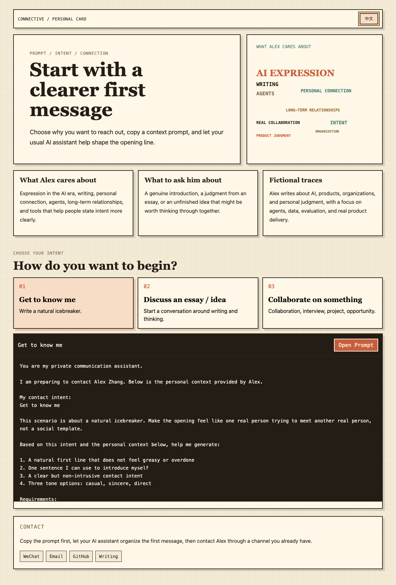

# Connective

**A prompt-native personal homepage for better first messages.**

[中文说明](README.zh-CN.md) · [Run locally](#run-locally) · [Configure](#configure-your-profile) · [Deploy](#deploy) · [Claude Code prompt](#claude-code-deployment-prompt) · [Codex prompt](#codex-deployment-prompt)

Connective is a Pixel Paper static site for personal connection. A visitor reads a compact personal card, chooses an intent, copies a context-rich prompt, and gives it to their own AI assistant to write a clearer first message.

The demo persona is fictional: Zhang San / Alex Zhang.



## What It Does

The page keeps one lightweight loop:

1. Read the personal context.
2. Choose from three intent cards: get to know me, discuss an essay or idea, collaborate on something.
3. Preview the generated prompt.
4. Switch between Chinese and English.
5. Copy the prompt, or copy it and open Gemini, ChatGPT, DeepSeek, or Grok.
6. Paste it into an AI assistant before contacting the person.

## Run Locally

```bash
python3 -m http.server 4173
```

Open:

```text
http://localhost:4173
```

Run tests:

```bash
node --test tests/*.test.js
```

## Configure Your Profile

There are two ways to customize the site.

### Option A: Terminal Wizard

Run the zero-dependency setup script:

```bash
node scripts/configure-profile.mjs
```

The wizard asks for the minimum useful profile details:

- Chinese and English names
- One-line positioning
- Interest words for the visual lockup
- Three context cards
- Public contact routes
- Optional advanced edits for hero copy, purpose cards, prompt guardrails, and full prompt context

It writes:

- `data.js`, used directly by the static page
- `profile.local.json`, your local editable profile file

`profile.local.json` is ignored by Git by default so you can keep private drafts local.

### Option B: Structured Form

Copy the example form:

```bash
cp profile.example.json profile.local.json
```

Edit `profile.local.json`, then generate the site data:

```bash
node scripts/configure-profile.mjs --input profile.local.json --output data.js --save profile.local.json --yes
```

The form covers identity, hero copy, interest words, context cards, purpose cards, contact copy, bilingual profile context, and prompt guardrails.

## Deploy

Connective is a static site. It does not need a build step.

### GitHub Pages

Recommended default.

1. Push this repository to GitHub.
2. In GitHub, open `Settings -> Pages`.
3. Set `Build and deployment` to `GitHub Actions`.
4. Push to `main`, or run the `Deploy static site to Pages` workflow manually.

The included `.github/workflows/pages.yml` publishes the repository root as the site.

### Vercel

Import the repository and use:

- Framework preset: `Other`
- Build command: leave empty
- Output directory: `.`

### Netlify

Create a new site from Git and use:

- Build command: leave empty
- Publish directory: `.`

### Cloudflare Pages

Connect the repository and use:

- Framework preset: `None`
- Build command: leave empty
- Output directory: `.`

## Claude Code Deployment Prompt

Copy this into Claude Code:

```text
You are helping me deploy a customized Connective personal homepage.

Repository: https://github.com/SevenTianyu/Connective

Please do the following step by step:
1. Clone the repository and inspect README.md, README.zh-CN.md, profile.example.json, data.js, and scripts/configure-profile.mjs.
2. Ask me for the personal information needed to replace the demo profile. Ask in small groups: names, one-line positioning, interests, context cards, purpose-card wording, prompt context, contact routes, and preferred deployment platform.
3. Do not invent personal experiences, contact details, credentials, or public claims. If I only provide Chinese content, draft the English version and ask me to confirm it.
4. Write the confirmed information into profile.local.json.
5. Run: node scripts/configure-profile.mjs --input profile.local.json --output data.js --save profile.local.json --yes
6. Run: node --test tests/*.test.js
7. Start a local preview with: python3 -m http.server 4173
8. Show me the local URL and summarize exactly what personal information will be public.
9. Ask for my confirmation before deploying.
10. After I confirm, deploy to my chosen static hosting target. Prefer GitHub Pages unless I choose another platform.
```

## Codex Deployment Prompt

Copy this into Codex:

```text
Implement a customized deployment of Connective.

Repository: https://github.com/SevenTianyu/Connective

Work as an implementation agent:
1. Clone the repo, inspect the current static app, and read README.md, README.zh-CN.md, and profile.example.json.
2. Interview me interactively for the profile content: bilingual name, one-line positioning, interest words, three context cards, three intent cards, contact routes, and deployment target.
3. Keep privacy boundaries explicit. Do not fabricate personal facts. Do not publish phone numbers, emails, social links, or other personal data until I confirm the final public summary.
4. Create or update profile.local.json from my answers.
5. Generate data.js with:
   node scripts/configure-profile.mjs --input profile.local.json --output data.js --save profile.local.json --yes
6. Run:
   node --test tests/*.test.js
7. Preview locally:
   python3 -m http.server 4173
8. Verify Chinese/English switching, prompt preview, and copy/open behavior in a browser.
9. Summarize changed files and the final public profile content.
10. Ask for my explicit confirmation before pushing or deploying. If I confirm, deploy through GitHub Pages by default, or through Vercel, Netlify, or Cloudflare Pages if I choose one.
```

## File Overview

- `index.html` defines the static page structure.
- `styles.css` defines the Pixel Paper visual system.
- `data.js` contains the active bilingual profile and prompt data.
- `profile.example.json` is the structured customization form.
- `scripts/configure-profile.mjs` turns a profile JSON file into `data.js`.
- `README.zh-CN.md` is the complete Chinese README.
- `public/readme/` contains the promotional image and language-matched screenshots.
- `tests/` covers prompt data, static files, and profile generation.
