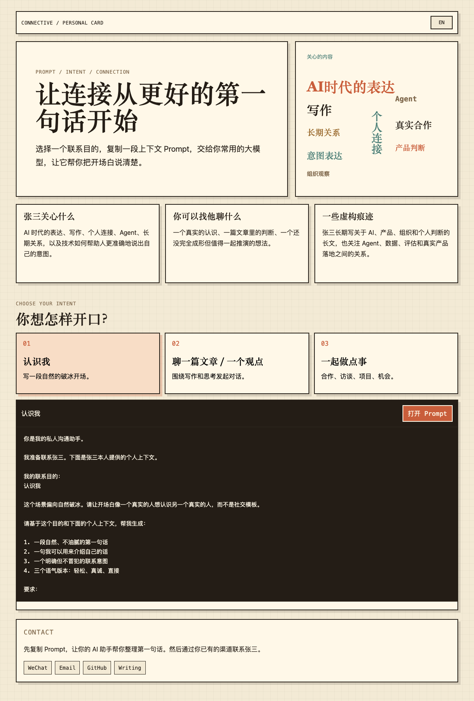

# Connective / 接点

**一个以 Prompt 为核心的个人主页模板，用来写出更好的第一句联系信息。**

[English README](README.md) · [快速运行](#快速运行) · [配置个人信息](#配置个人信息) · [部署](#部署) · [Claude Code 提示词](#claude-code-部署提示词) · [Codex 提示词](#codex-部署提示词)

Connective 是一个 Pixel Paper 风格的静态个人连接页。访问者先阅读一张紧凑的个人上下文卡片，再选择联系目的，复制一段带上下文的 Prompt，交给自己的 AI 助手写出更清楚、更自然的第一句话。

演示人物是虚构的：张三 / Alex Zhang。



## 它能做什么

页面只保留一个轻量闭环：

1. 阅读个人上下文。
2. 从三张目的卡片中选择：认识我、聊一篇文章 / 一个观点、一起做点事。
3. 预览自动生成的 Prompt。
4. 在中文和英文之间切换。
5. 复制 Prompt，或者复制后打开 Gemini、ChatGPT、DeepSeek、Grok。
6. 在真正联系对方之前，先把 Prompt 粘贴到自己的 AI 助手里整理开场白。

## 快速运行

```bash
python3 -m http.server 4173
```

打开：

```text
http://localhost:4173
```

运行测试：

```bash
node --test tests/*.test.js
```

## 配置个人信息

有两种方式可以把模板改成你自己的主页。

### 方式 A：终端向导

运行零依赖配置脚本：

```bash
node scripts/configure-profile.mjs
```

向导会询问最必要的个人资料：

- 中文和英文姓名
- 一句话定位
- 用于视觉字块的兴趣关键词
- 三张上下文卡片
- 公开联系方式
- 可选高级内容，包括首页文案、目的卡片、Prompt 约束和完整个人上下文

它会写入：

- `data.js`，静态页面会直接读取这个文件
- `profile.local.json`，本地可继续编辑的个人资料文件

`profile.local.json` 默认被 Git 忽略，所以可以把私密草稿留在本地。

### 方式 B：结构化表单

复制示例表单：

```bash
cp profile.example.json profile.local.json
```

编辑 `profile.local.json`，然后生成页面数据：

```bash
node scripts/configure-profile.mjs --input profile.local.json --output data.js --save profile.local.json --yes
```

这个表单覆盖身份信息、首页文案、兴趣关键词、上下文卡片、目的卡片、联系方式文案、中英文个人上下文和 Prompt 约束。

## 部署

Connective 是纯静态站点，不需要构建步骤。

### GitHub Pages

默认推荐。

1. 把这个仓库推到 GitHub。
2. 在 GitHub 打开 `Settings -> Pages`。
3. 把 `Build and deployment` 设置为 `GitHub Actions`。
4. 推送到 `main`，或者手动运行 `Deploy static site to Pages` workflow。

仓库内置的 `.github/workflows/pages.yml` 会把项目根目录发布为站点。

### Vercel

导入仓库后使用：

- Framework preset：`Other`
- Build command：留空
- Output directory：`.`

### Netlify

从 Git 创建新站点后使用：

- Build command：留空
- Publish directory：`.`

### Cloudflare Pages

连接仓库后使用：

- Framework preset：`None`
- Build command：留空
- Output directory：`.`

## Claude Code 部署提示词

把下面这段复制到 Claude Code：

```text
你正在帮我部署一个定制版 Connective 个人主页。

仓库：https://github.com/SevenTianyu/Connective

请一步一步完成：
1. 克隆仓库，检查 README.md、README.zh-CN.md、profile.example.json、data.js 和 scripts/configure-profile.mjs。
2. 向我询问替换演示资料所需的个人信息。请分小组询问：姓名、一句话定位、兴趣关键词、上下文卡片、目的卡片文案、Prompt 上下文、联系方式和希望部署的平台。
3. 不要编造个人经历、联系方式、资质或公开声明。如果我只提供中文内容，请先草拟英文版本并让我确认。
4. 把确认后的信息写入 profile.local.json。
5. 运行：node scripts/configure-profile.mjs --input profile.local.json --output data.js --save profile.local.json --yes
6. 运行：node --test tests/*.test.js
7. 启动本地预览：python3 -m http.server 4173
8. 给我本地访问地址，并明确总结哪些个人信息会被公开。
9. 部署前先请求我的确认。
10. 我确认后，再部署到我选择的静态托管平台。除非我选择其他平台，否则优先使用 GitHub Pages。
```

## Codex 部署提示词

把下面这段复制到 Codex：

```text
请实现一个定制版 Connective 部署。

仓库：https://github.com/SevenTianyu/Connective

你作为实现代理工作：
1. 克隆仓库，检查当前静态应用，并阅读 README.md、README.zh-CN.md 和 profile.example.json。
2. 通过交互方式询问我的个人主页内容：中英文姓名、一句话定位、兴趣关键词、三张上下文卡片、三张目的卡片、联系方式和部署目标。
3. 明确保护隐私边界。不要编造个人事实。在我确认最终公开信息之前，不要发布手机号、邮箱、社交链接或其他个人数据。
4. 根据我的回答创建或更新 profile.local.json。
5. 用下面命令生成 data.js：
   node scripts/configure-profile.mjs --input profile.local.json --output data.js --save profile.local.json --yes
6. 运行：
   node --test tests/*.test.js
7. 本地预览：
   python3 -m http.server 4173
8. 在浏览器里验证中文/英文切换、Prompt 预览和复制/打开行为。
9. 总结改动文件和最终会公开的个人资料内容。
10. 推送或部署前请求我的明确确认。如果我确认，默认用 GitHub Pages 部署；如果我选择 Vercel、Netlify 或 Cloudflare Pages，就按对应平台部署。
```

## 文件说明

- `index.html` 定义静态页面结构。
- `styles.css` 定义 Pixel Paper 视觉系统。
- `data.js` 保存当前生效的双语个人资料和 Prompt 数据。
- `profile.example.json` 是结构化配置表单示例。
- `scripts/configure-profile.mjs` 会把个人资料 JSON 转成 `data.js`。
- `README.md` 是完整英文 README。
- `public/readme/` 存放宣传图和语言匹配的项目截图。
- `tests/` 覆盖 Prompt 数据、静态文件和个人资料生成逻辑。
